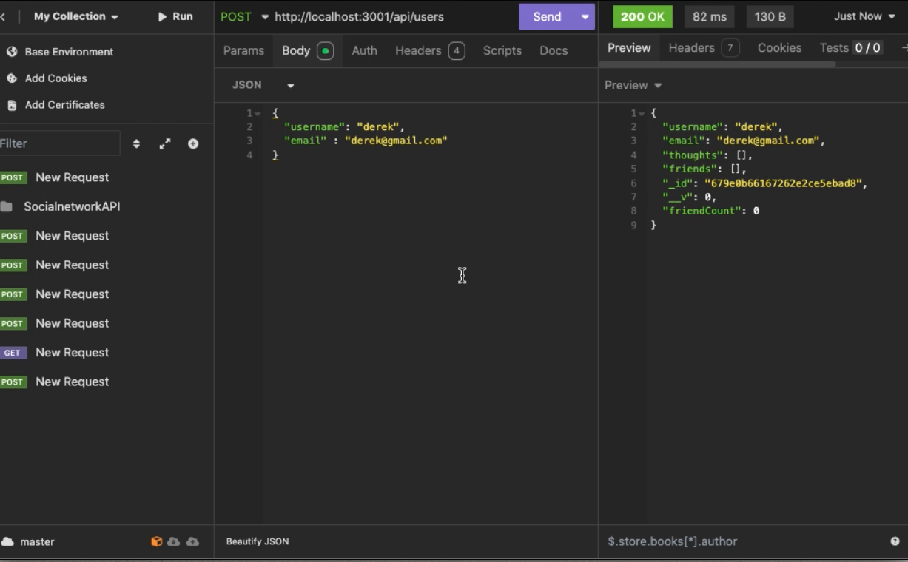
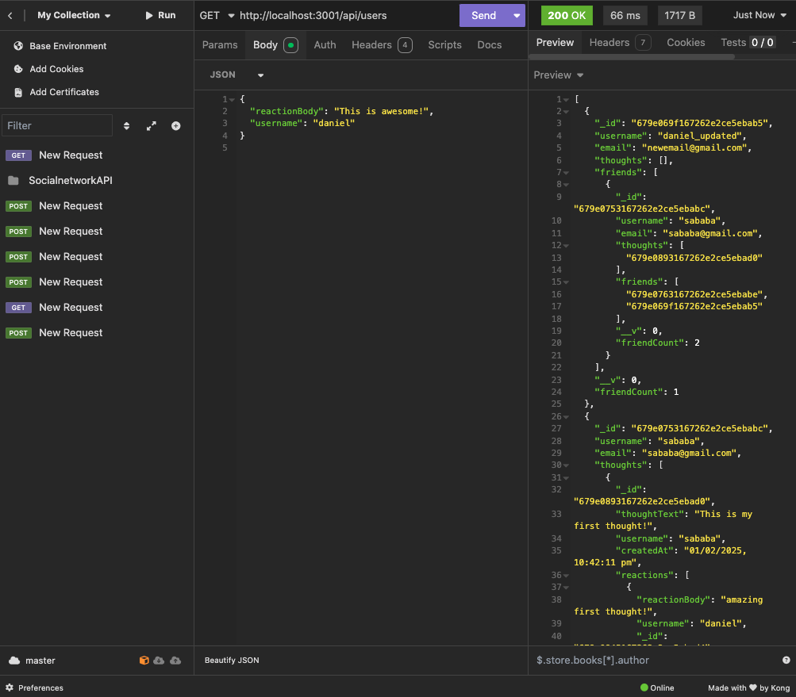
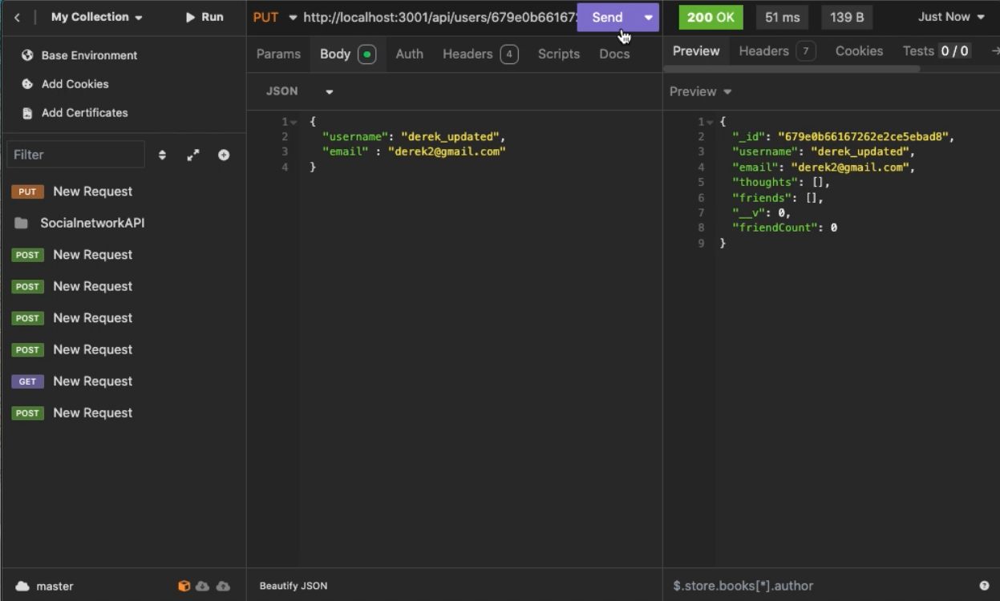
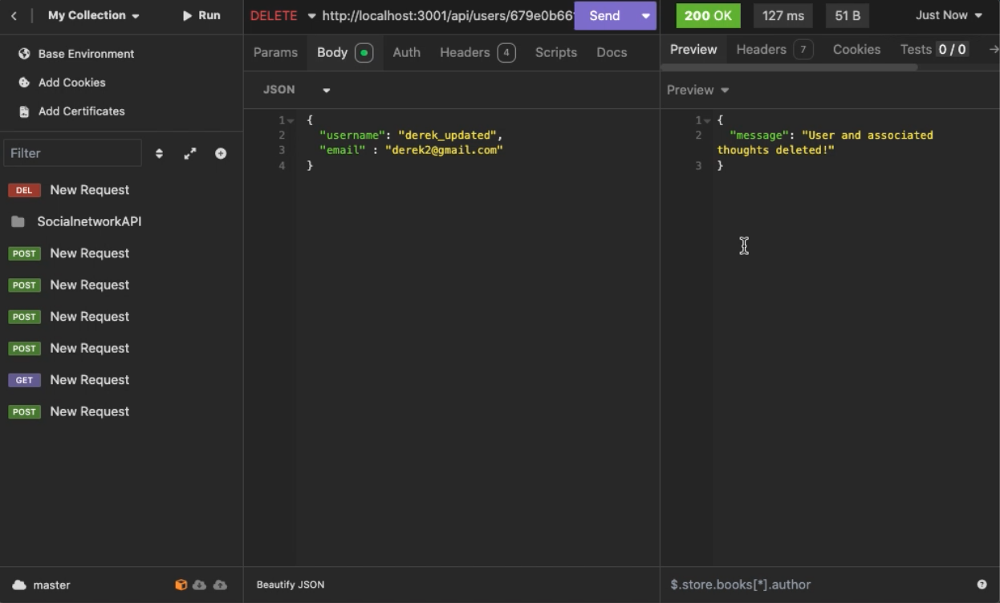

# Social-Network-API

This project is a Social Network API built using Express.js, MongoDB, and Mongoose. It allows users to share thoughts, react to others' thoughts, and manage friend lists. The API offers various functionalities like creating, updating, deleting users and thoughts, adding and removing friends, and handling reactions to thoughts. This project was developed to practice working with NoSQL databases, API routing, and MongoDB.






## Installation

-Clone the repository to your local machine:
```
Copy
git clone 
```
-Navigate to the project folder:
```
cd social-network-api
```
-Install the dependencies:
```
npm install
```
-Set up your environment variables (e.g., MongoDB connection string) in a .env file.

-Run the server:
```
npm start
```
The server will start, and the Mongoose models will be synced to the MongoDB database.

## API Routes

🚀 1. Add a New Request in Insomnia

-Open Insomnia.

-Click "New Request" → Name it (e.g., "Create User") → Select POST → Click Create.

👤 2. Create a New User (POST /api/users)

# Method: POST

URL: http://localhost:3001/api/users
Body (JSON):
```
{
  "username": "daniel",
  "email": "daniel@gmail.com"
}
```

In Insomnia:
Select Body → JSON.
Paste the JSON above.
Click Send.


📋 3. Get All Users (GET /api/users)

# Method: GET

URL: http://localhost:3001/api/users
Click Send.
Response: A list of all users in the database.

👤 4. Get a Single User (GET /api/users/:userId)

# Method: GET

URL: http://localhost:3001/api/users/{userId} (replace {userId} with an actual ID)
Click Send.

✏ 5. Update a User (PUT /api/users/:userId)

# Method: PUT
URL: http://localhost:3001/api/users/{userId}
Body (JSON):
```
{
  "username": "daniel_updated",
  "email": "newemail@gmail.com"
}
```
Click Send.

❌ 6. Delete a User (DELETE /api/users/:userId)
# Method: DELETE

URL: http://localhost:3001/api/users/{userId}
Click Send.

🤝 7. Add a Friend (POST /api/users/:userId/friends/:friendId)
# Method: POST

URL: http://localhost:3001/api/users/{userId}/friends/{friendId}
Click Send.

💔 8. Remove a Friend (DELETE /api/users/:userId/friends/:friendId)

# Method: DELETE
URL: http://localhost:3001/api/users/{userId}/friends/{friendId}
Click Send.

🧠 9. Create a Thought (POST /api/thoughts)

# Method: POST

URL: http://localhost:3001/api/thoughts
Body (JSON):
```
{
  "thoughtText": "This is my first thought!",
  "username": "daniel",
  "userId": "userId_here"
}
```
Click Send.

## Walkthrough Video
A walkthrough video demonstrating the functionality of this API and showing all the acceptance criteria can be found here : 

## License
This project is licensed under the MIT License - see the LICENSE file for details.
